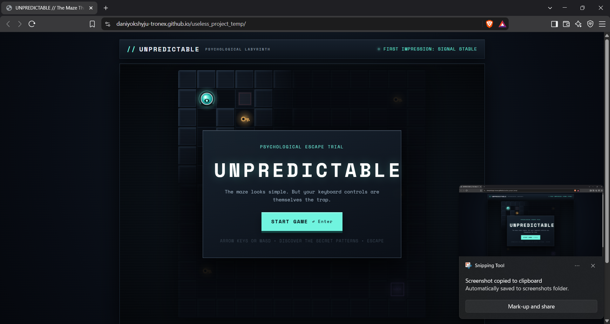
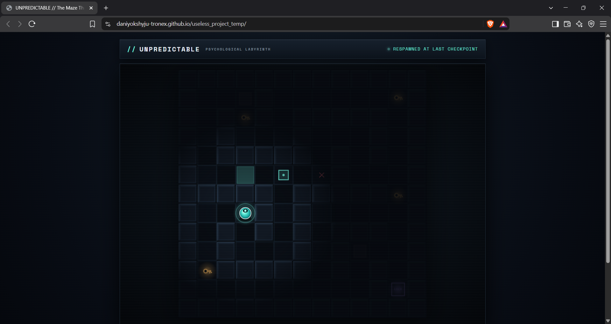
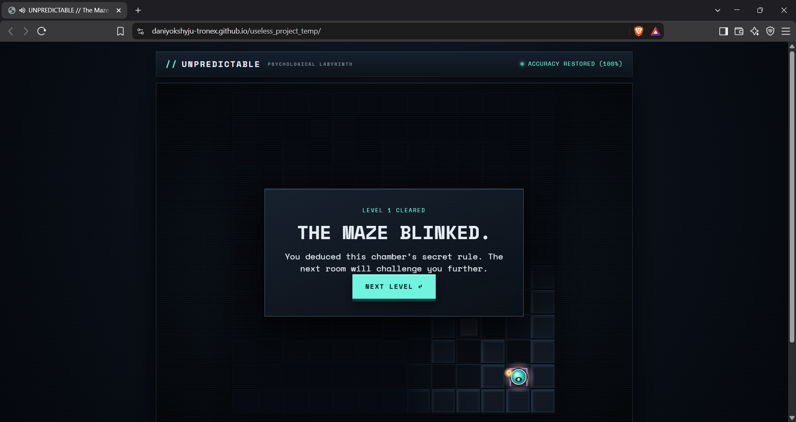
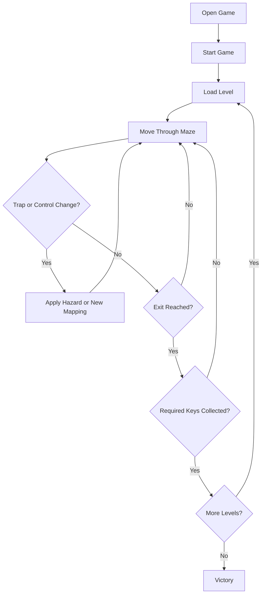

# UNPREDICTABLE: The Psychological Trap Maze 🎯

## Basic Details

### Team Name

**The Unpredictables**

### Team Members

- **Nimal Krishna** - ICCS College of Engineering and Management
- **Daniyo K Shyju** - ICCS College of Engineering and Management

### Project Description

UNPREDICTABLE is a 2D psychological trap-maze browser game. Players must explore five handcrafted levels, collect keys, survive hidden hazards, and reach the exit while the game changes the meaning of their keyboard controls.

The game combines exploration, memory, reaction, and pattern recognition in a lightweight web experience that runs without installation or external libraries.

### The Problem (that doesn't exist)

People can usually trust that pressing the **Up** key will move them up. This project solves the imaginary problem of keyboards being far too predictable and players escaping mazes too easily.

### The Solution (that nobody asked for)

We created a maze that changes the rules while the player is inside it. Controls can rotate, reverse, mirror, or become delayed. Fake exits, falling floors, moving enemies, checkpoints, and glitch effects make every successful escape feel earned.

**UNPREDICTABLE** is a 2D top-down psychological trap/maze browser game built with pure HTML5, CSS3, and JavaScript. The maze looks like a clean grid, but the core psychological twist is that **YOUR KEYBOARD CONTROLS ARE THEMSELVES A TRAP**.

The game is designed to be challenging, disorienting, yet **always mathematically solvable**. The maze does not use erratic pure randomness—it uses controlled, deterministic psychological patterns that observant players can deduce and overcome.

---

## Table of Contents

1. [How to Run the Game in VS Code](#how-to-run-the-game-in-vs-code)
2. [Controls](#controls)
3. [Game Mechanics](#game-mechanics)
4. [The Secret Pattern System](#the-secret-pattern-system)
5. [Level Progression & Design](#level-progression--design)
6. [The 15 Traps & Hazards](#the-15-traps--hazards)
7. [The Modular Control-Shuffle System](#the-modular-control-shuffle-system)
8. [Developer Guide](#developer-guide)
   - [How to Add New Levels](#how-to-add-new-levels)
   - [How to Add New Traps](#how-to-add-new-traps)
   - [How to Modify Control Mappings](#how-to-modify-control-mappings)
9. [Project Structure](#project-structure)

---

## Technical Details

### Technologies/Components Used

#### For Software

- **Languages:** HTML5, CSS3, and JavaScript using ES modules
- **Frameworks:** None
- **Libraries:** None
- **Browser APIs:** HTML Canvas, Web Audio API, DOM Events, and `requestAnimationFrame`
- **Tools:** Visual Studio Code, PowerShell, and a modern web browser

#### For Hardware

- Computer or laptop
- Keyboard for movement and game controls
- Display and speakers or headphones
- No special electronic components are required

### Implementation

The application is divided into modules for the game loop, player movement, collision and solvability checks, levels, traps, control mutations, user interface, and procedural audio. Five handcrafted levels combine these modules into a progressively more difficult maze experience.

## How to Run the Game in VS Code

### Option 1: Live Server Extension (Recommended)
1. Open Visual Studio Code.
2. Select **File > Open Folder...** and choose the `useless_project_temp` directory.
3. If not already installed, install the **Live Server** extension (by Ritwick Dey).
4. Right-click on `index.html` in the file explorer and click **Open with Live Server**.
5. The game will launch automatically in your browser at `http://127.0.0.1:5500/index.html`.

### Option 2: PowerShell Static Server
Run the included lightweight script directly from your terminal:
```powershell
./start-game.ps1
```
This serves `index.html` and ES modules on `http://localhost:5500/`.

### Option 3: Standalone HTML
You can open **`unpredictable-standalone.html`** directly in a browser. For the complete experience, use **`PLAY GAME.cmd`**, which starts the local server so the audio files and failure animation load correctly.

---

## Controls

The game is entirely playable with keyboard:

| Action | Primary Key | Alternative |
| :--- | :--- | :--- |
| **Move Up** | `ArrowUp` | `W` |
| **Move Down** | `ArrowDown` | `S` |
| **Move Left** | `ArrowLeft` | `A` |
| **Move Right** | `ArrowRight` | `D` |
| **Confirm / Start / Next / Retry** | `Enter` | Click button |
| **Pause / Resume** | `Escape` | `P` or Pause button |

> **Crucial Rule**: While your physical keys remain the same, **the meaning of each arrow key will shift** depending on the room, traps, zones, or key pickups. You must adapt your mental model dynamically.

---

## Game Mechanics

1. **Objective**: Reach the glowing violet **EXIT** portal alive.
2. **Key Requirement**: Most levels feature a locked exit requiring a glowing amber **KEY**.
3. **Surprise Key Consequences**: Picking up a key destabilizes the maze—screen glitches, audio crackles, and controls mutate immediately.
4. **Attempts & Checkpoints**:
   - You begin each run with **3 Attempts**.
   - Stepping on a lethal trap consumes 1 attempt and smoothly resets you to your **most recently activated Checkpoint** (or origin) without reloading the page.
   - If all 3 attempts are lost, the screen proclaims **“THE MAZE WON.”** and you can click **TRY AGAIN**.
5. **Atmospheric Lighting**:
   - Subtle dynamic fog of war surrounds your character.
   - Discovered traps reveal faint glyphs and indicators so you can remember hazardous routes.
6. **Procedural Solvable Variations**:
   - When restarting after a failure, trap offsets or delay timings vary subtly, but the maze is guaranteed to remain 100% beatable via pathfinding validation.

---

## The Secret Pattern System

The maze does not rely on unfair random chaos. Each area operates according to hidden geometric rules:
- **Room Rotations**: A room may always map `Up → Right`, `Right → Down`, `Down → Left`, `Left → Up`.
- **Inversion Corridors**: Corridors may strictly invert your axis (`Left ↔ Right` or `Up ↔ Down`).
- **Twist Tiles**: Stepping on a twist tile modifies your *next step* according to its glyph.
- **Latency Zones**: Certain chambers buffer your inputs for 500ms before executing.

By observing the subtle glitch feedback and directional response, skilled players can understand the logic and navigate with confidence.

---

## Level Progression & Design

The campaign consists of **5 playable psychological levels**:

### Level 1: FIRST IMPRESSION
- **Theme**: Teaching normal movement & the first unexpected betrayal.
- **Mechanics**: Straightforward navigation with spike traps, a central checkpoint, and a key.
- **Surprise**: Picking up the key immediately flips controls to `REVERSED` (`Up ↔ Down`, `Left ↔ Right`) and arms defensive spikes along the return corridor.

### Level 2: THE SECOND GUESS
- **Theme**: Geometric rotations and deceptive flooring.
- **Mechanics**:
  - The East Wing uses `ROTATED_RIGHT` (90° clockwise).
  - The West Shaft uses `ROTATED_LEFT` (90° counter-clockwise).
  - Introduces crumbly falling floors, a one-way corridor shaft, and fake safe tiles that collapse when stepped on.

### Level 3: TIME & SPACE
- **Theme**: Delayed inputs and folded dimensions.
- **Mechanics**:
  - **Delayed Input Trap**: Moves queue into an input buffer and execute with a 500ms delay.
  - **Decoy Fake Exit**: An exit that looks authentic but warps the player into a trial room.
  - **Teleport Rifts**: Transport the player back to earlier antechambers.
  - **Moving Wall**: Periodically crushes the path to the real exit.

### Level 4: THE PHANTOM CHAMBER
- **Theme**: Patrolling watchers and temporary barriers.
- **Mechanics**:
  - Two patrolling shadow sentinels with piercing glowing eyes move on fixed patrol loops.
  - Invisible pressure plates toggle temporary laser walls.
  - Mirrored control corridors and disappearing crumbly bridges over abyssal voids.

### Level 5: THE FINAL LABYRINTH
- **Theme**: The grand convergence of all psychological mechanics.
- **Mechanics**: Combines rotating control zones, patrolling watchers, delayed latency fields, decoy fake exits, crumbling chasm bridges, one-way security seals, and inverted heading twist tiles. Deciphering the rooms unlocks the true escape.

---

## The 15 Traps & Hazards

1. **Spike Trap** (`spike`): Hidden or timed floor spikes that deal lethal damage on contact.
2. **Falling Floor** (`falling`): Floor that begins cracking when stepped on and collapses into an impassable void after 700ms.
3. **Fake Safe Tile** (`fake-safe`): Visually identical to normal corridor floors until stepped on, whereupon it collapses into spikes.
4. **Moving Wall** (`moving-wall`): Metallic wall barrier that slides back and forth rhythmically; crushes players caught in its path.
5. **Invisible Trigger** (`invisible-trigger`): Hidden pressure plate that opens or shuts temporary walls elsewhere in the maze.
6. **Teleport Trap** (`teleport`): Spatial rift that warps the player to a disorienting coordinate.
7. **Direction-Changing Trap** (`direction`): Floor tile that mutates player control schemes (`REVERSED`, `ROTATED_LEFT`, `ROTATED_RIGHT`, `MIRRORED`, `RANDOMIZED`).
8. **Delayed Movement Trap** (`delay`): Activates a 500ms input latency buffer on all subsequent movements.
9. **Fake Exit** (`fake-exit`): Deceptive glowing purple exit door labeled "EXIT?"; stepping on it glitches the screen and drops the player into a hazard or teleport rift.
10. **Reset Trap** (`reset`): Teleports the player back to the room entrance or checkpoint.
11. **Moving Enemy** (`moving-enemy`): Menacing shadow watchers that patrol set routes; touching one is instant death.
12. **Temporary Wall** (`temporary-wall`): Energy barrier that periodically toggles between solid and open, or raises upon trigger activation.
13. **Disappearing Floor** (`disappearing-floor`): Fragile bridge tile that flashes and disintegrates permanently after being stepped on.
14. **One-Way Corridor** (`one-way`): Floor gate marked with a directional chevron; allows passage only in the designated arrow direction.
15. **Control-Shuffle Zone** (`control-zone`): Ambient shimmering floor area that forces a specific control mode while traversing through it.

---

## The Modular Control-Shuffle System

The control system in `js/controls.js` is completely modular and built around the `ControlManager` class:

```javascript
import { ControlManager } from './controls.js';

const controls = new ControlManager((modeName) => {
  console.log('Controls shifted to:', modeName);
});

// Switch modes on the fly:
controls.setNormalControls();      // Default arrow mapping
controls.setReversedControls();    // Inverted 180°
controls.setRotatedControls('right'); // 90° Clockwise
controls.setRotatedControls('left');  // 90° Counter-Clockwise
controls.setMirroredControls('horizontal'); // Left <-> Right
controls.setRandomControls(seed);  // Controlled deterministic permutation
controls.setDelayedControls(500);  // 500ms buffered delay
```

---

## Developer Guide

### How to Add New Levels
Open `js/levels.js` and add a new level object to the `LEVELS` array:

```javascript
const MY_CUSTOM_LEVEL = createLevel({
  id: 6,
  name: 'THE LABYRINTH OF MIRRORS',
  subtitle: 'REFLECTIONS DECEIVE',
  map: [
    '#############',
    '#S..#.......#',
    '#.#.#.#####.#',
    '#.#...#...#.#',
    '#.#####.#.#.#',
    '#.........#E#',
    '#############'
  ],
  start: { x: 1, y: 1 },
  exit: { x: 11, y: 5 },
  key: { x: 9, y: 1 },
  requiresKey: true,
  checkpoints: [{ x: 5, y: 3, name: 'SAFE ALCOVE' }],
  traps: [
    { x: 3, y: 1, type: 'spike', label: 'SPIKE TRAP' },
    { x: 7, y: 1, type: 'direction', mode: 'ROTATED_RIGHT', label: 'ROTATED' }
  ],
  zones: [
    { x: 5, y: 5, mode: 'MIRRORED' }
  ]
});

LEVELS.push(MY_CUSTOM_LEVEL);
```

### How to Add New Traps
1. Add the trap definition in `js/levels.js` with your chosen type name (e.g. `type: 'freeze'`).
2. Open `js/traps.js`:
   - In `activate(trap, x, y)`, add a case to execute the behavior:
     ```javascript
     case 'freeze':
       this.game.status = 'FROZEN IN PLACE';
       this.game.controls.setDelayedControls(1000);
       break;
     ```
   - In `draw(ctx, size)`, add visual rendering for the discovered state.

### How to Modify Control Mappings
To create a custom control mapping:
1. Open `js/controls.js`.
2. Add a new method to `ControlManager`:
   ```javascript
   setDiagonalChaosControls(announce = true) {
     this.setMap('CHAOS', {
       ArrowUp: 'left',
       ArrowDown: 'right',
       ArrowLeft: 'down',
       ArrowRight: 'up'
     }, 0, announce);
   }
   ```
3. Trigger it from `Game.changeControls('CHAOS')` or a level zone.

---

## Project Structure

```
unpredictable-game/
│
├── index.html                  # Main entry point with full HUD and canvas
├── style.css                   # Atmospheric styling, CRT scanlines, and screen-shake
├── README.md                   # Complete documentation and developer guide
├── PLAY GAME.cmd               # Windows single-click instant launcher
├── start-game.ps1              # Built-in PowerShell HTTP server
├── unpredictable-standalone.html # Single-file zero-dependency version
│
├── js/
│   ├── main.js                 # Entry point: initializes Game instance
│   ├── game.js                 # Core game loop, rendering, and event coordination
│   ├── player.js               # Player entity, movement interpolation, and states
│   ├── controls.js             # Modular ControlManager with all control mutations
│   ├── traps.js                # All 15 traps, patrolling enemies, and moving walls
│   ├── levels.js               # 5 handcrafted levels & procedural solvability
│   ├── collision.js            # Boundary collision, BFS pathfinding, and checks
│   ├── ui.js                   # HUD management, modals, and screen effects
│   └── audio.js                # Web Audio API procedural sound synthesizer
│
└── assets/
    └── README.md               # Asset notes (procedural graphics and Web Audio)
```

---

## Zero Dependencies
- No external node modules, npm packages, or bundlers required.
- No paid image or sound assets (graphics are procedural Canvas; audio is Web Audio API).
- Runs directly in any modern web browser.

---

## Screenshots (Add at least 3)

Add screenshots to a `screenshots/` folder and update these links before submission:


*The start screen introduces the psychological escape trial.*


*Gameplay view showing the maze, player, key, exit, and HUD.*


*A screen which pops up on clearing a level.*

## Diagrams



*Workflow of the game from startup to victory.*

## Project Demo

### Video

Add the final demonstration video link here. The video should show the game startup, keyboard movement, at least one control mutation, a trap or checkpoint, and a successful level completion.

### Additional Demos

- Repository: `https://github.com/daniyokshyju-TRONEX/useless_project_temp`
- Live demo: Add a deployment link here, if available.

## Team Contributions

- **Nimal Krishna:** Game concept, core game loop, player movement, level progression, collision handling, and integration.
- **Daniyo K Shyju:** Trap and control-shuffle concepts, user interface styling, audio/visual effects, testing, and documentation.

Both team members contributed to gameplay testing, debugging, and final refinement.
